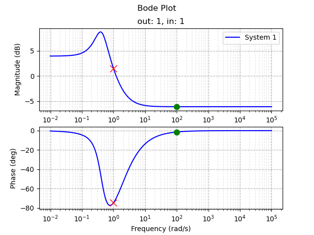
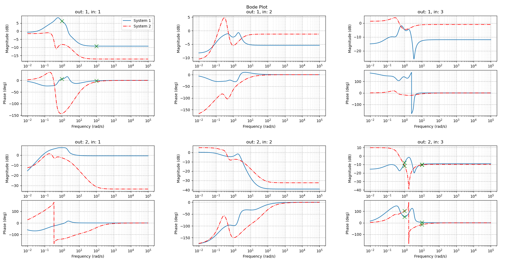

# Linear DAEs and Bode plots in Python

Tools for representing systems of linear DAEs and ODEs of the form (square or rectangular)

$$E \dot{x} = A x + B u, \quad y = C x + D u,$$

and for generating their Bode plots / frequency responses associated to the transfer matrix
$$H(s) = C (s E - A)^{-1} B + D.$$

# Basic Usage

To use, ensure the directory 'linear_daes' ('.\linear_daes' in this repo) is found in your Python search path, make sure that Matplotlib, NumPy, and SciPy are installed (see '.\env\py-linear-daes-env.yml' for a conda environment that can be imported).

Create system matrices as ndarrays of dimension 2 in NumPy, then you can create a LinearDAE object representing the system.
```
import numpy as np
import linear_daes as ld

n = 5 # state dimension
m = 1 # input dimension
p = 1 # output dimension

# create a random DAE
E = np.random.random_sample((n,n))
A = np.random.random_sample((n,n))
B = np.random.random_sample((n,m))
C = np.random.random_sample((p,n))
D = np.random.random_sample((p,m))

system = ld.LinearDAE(A, B, C, D, E, label="System 1")
```
The LinearDAE constructor checks that dimensions are consistent (the system must be square or rectangular), and it will also check if the system is regular (having unique solutions for consistent initial conditions). While the constructor will accept rectangular (non-square, but consistent dimension) systems, such systems can't be regular so you will not be able to use the Bode plot tools; however, you can still use the LinearDAE object as a container for passing rectangular systems to modules, etc.

You can check if the system is an ODE (det(E) != 0), if it is regular, and its dimensions.
```
print(system.isODE, system.isRegular, system.n_r, system.n_c, system.m, system.p)
```
You can also evaluate the system's transfer function (so long as it is regular), returning a 2darray (important for MIMO systems).
```
print(system.tf(complex(real=0.0, imag=1.0)))
```
Finally, you can create a BodePlot object and assign the system to it.
```
bode_plot = ld.BodePlot()
bode_plot.add_system(system, color='b', linestyle='solid', linewidth=1.5)
```
Add some data ticks by specifying the frequency, the system to 'pin' the tick to, and the input/output plot to place the tick on (important for MIMO systems).
```
bode_plot.add_data_tick(at_frequency=1, pin_to_system_num=0, pin_to_output_num=1, pin_to_input_num=1, markersize=10, color='r')
bode_plot.add_data_tick(at_frequency=100, pin_to_system_num=0, pin_to_output_num=1, pin_to_input_num=1, color='g', marker='o', markersize=8)
```
Specify a frequency range, and show the plot!
```
w_start = -2           # power of 10 to start evaluating frequencies
w_end = 5              # power of 10 to end evaluating frequencies
w_num_points = 10000   # total number of log-spaced points to evaluate

bode_plot.show(w_start, w_end, w_num_points)
```

Note that matplotlib.pyplot.show() erases the plot, so if you want to alter / save / etc the plot before showing, indicate in the show method that the plot should be generated but not shown, then retrieve the plot, do whatever you want, and call the show_after_generate_only method.
```
bode_plot.show(w_start, w_end, w_num_points, generate_only=True)
bode_plot.fig.savefig("fig_test.png")
bode_plot.show_after_generate_only()
```

# Samples


See ./example_usage_1.py for a plot of the following form.



See ./example_usage_2.py for a plot of the following form.



# Additional Convenience Functions in the linear_daes Module


Given a complex matrix Z, return its entry-wise magnitude in dB.
```
complex_to_dB(Z: npt.NDArray[np.complex_] | complex) -> np.ndarray
```

Given a complex matrix Z, return its entry-wise phase in degrees.
```
complex_to_deg(Z: npt.NDArray[np.complex_] | complex) -> np.ndarray
```

Given a LinearDAE and a complex frequency, evaluate its (possibly MIMO) transfer matrix at the frequency.
```
eval_fr(system: LinearDAE, w: complex) -> tuple[npt.NDArray[np.complex_], npt.NDArray[np.complex_]]
```

Given a LinearDAE, real numbers w_start and w_end, and an integer w_num_points, return the LinearDAE's transfer matrix evaluated at w_num_points log-spaced points in the frequency range [complex(real=0.0,imag=1.0) * 10 ** (w_start), complex(real=0.0,imag=1.0) * 10 ** (w_end)].
```
eval_fr_range(system: LinearDAE, w_start: float, w_end: float, w_num_points: int) -> tuple[npt.NDArray[np.complex_],npt.NDArray[np.complex_]]
```


# To Do

- more documentation, docstrings
- flexibility on legend placement
- magnitude / phase labels for selected frequencies
- cleanup and commit unit test cases
- ODE time-domain simulations
- DAE time-domain simulations
